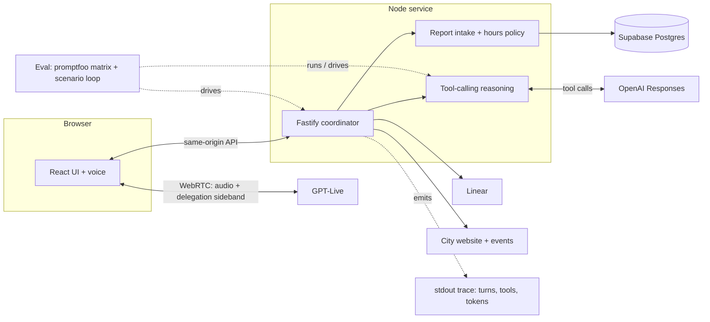

# Boulder municipal voice agent

A municipal voice agent for Boulder, Colorado — the Threefold developer-task take-home. A caller can ask a few reviewed questions (municipal code, service guidance, live events) or report a pothole / park-maintenance issue; the server collects and confirms the details against DB-backed Boulder hours, then routes to a simulated department during office hours or files a real Linear demo ticket after hours.

## System



The browser speaks to GPT-Live over WebRTC — audio plus a client-delegation sideband (`session.delegation` in, `commentary.append` out). GPT-Live never calls the backend directly: the browser relays each delegated turn to Fastify, which runs the reasoning step and returns the verified reply. The server — never the model — owns scope, time, confirmation, and every effect.

**Why client delegation.** GPT-Live is the speech model and the browser is its client. Rather than let the model call our tools directly (which would hand it an effect path we'd have to trust), it delegates each turn to the browser over a sideband channel; the browser sends the caller's text to Fastify, and a smaller reasoning model (`gpt-5.6-luna`) proposes a tool that the server validates before executing. Speech stays fluent in GPT-Live; authorization stays in our code.

## Tech choices and why

| Piece | Choice | Why |
| --- | --- | --- |
| Voice | GPT-Live, browser WebRTC, client delegation | No server WebSocket; the server owns effects by delegating each turn |
| Reasoning | tool-calling turn (`gpt-5.6-luna`) | A model picks the tool, the server validates it — more flexible than a brittle intent classifier |
| Server | Node 24 + Fastify | One long-lived service, typed and minimal |
| UI | React 19 + Vite | Single screen, fast feedback |
| State | Supabase Postgres, raw `pg` (no ORM) | Relational constraints + transactions match the confirmation/operation races; local stack + managed cloud; city policy lives in the DB, not code |
| Tickets | Linear (adapter + verified readback) | The real external ticket system; a create is only claimed after a readback matches |
| Answers | reviewed corpus + live fetch | Reviewed code/service answers are deterministic; events come from the official calendar, cached and fail-closed |
| Tooling | TypeScript, Biome, Vitest, Vite | Strict types, fast lint/format/test |

## How we built it

- **Research → spec.** Surveyed the task, the Boulder sources, and the tooling first; wrote `SPEC` + `DECISIONS` + `DEVELOPMENT_PLAN` before writing code.
- **Spec-driven (SDD).** The root `SPEC` owns scope, decisions, and evidence gates; component specs own contracts; accepted behavior changes update the `SPEC`.
- **Test-driven (TDD).** Each slice defines its acceptance/failure cases and a failing test before the implementation; bug fixes keep a regression case.
- **Engineering loop.** Run → evaluate with an independent harness (not the implementer) → fix → re-run. The `eval:` scripts and the promptfoo matrix make model quality measurable rather than assumed.

## Run locally

Requires Node 24.21.0, Docker, and the Supabase CLI.

```sh
npm ci
cp .env.example .env.local          # set CITY_ID=boulder-co; add LINEAR_* to enable tickets
supabase db start && supabase migration up --local
npm run dev                         # API :3001, UI :5173
```

Open http://127.0.0.1:5173. For voice, add `OPENAI_API_KEY` to `.env.dev` and click **Start voice**. The **Demo time** toggle flips the office open/closed so both the route and ticket paths can be seen. Use fictional report details.

## Test

```sh
npm run check               # offline: format, lint, type, unit tests
npm run test:db             # local Postgres adapters + API (needs the migrated DB)
npm run build
npm run audit:dependencies  # dependency advisory check
```

Opt-in paid model checks (need `OPENAI_API_KEY` in `.env.dev`):

```sh
npm run eval:reasoning -- --models=gpt-5.6-luna,<candidate> --repeats=3   # tool selection A/B
npm run eval:conversations                                                 # scenario loop (needs dev server)
npm run eval:ui && npm run eval:ui:view                                    # local promptfoo matrix + A/B
```

## Known limitations

- **In-process sessions** — the active-draft pointer and quota live in memory, so a restart drops them; durable drafts and filed tickets are unaffected.
- **Table grants instead of row-level security** — adequate for the single-tenant demo, but RLS is deferred.
- **No server `TransferProvider` port** — the simulated department handoff is a client-side effect, not a first-class provider.
- **Not yet implemented:** `check:spec`, `test:contracts`, browser (Playwright) tests, and a knowledge refresh/validate command.
- **Dev-only advisory:** the eval UI (`promptfoo`, never shipped) transitively pulls `extract-zip`, which has a high advisory that is never exercised here. The blocking gate audits runtime dependencies only (`npm run audit:dependencies` — clean); `npm run audit:all` reports the full picture.

## More

- [SPEC](SPEC.md) — scope, capabilities, evidence gates
- [DECISIONS](DECISIONS.md) — full rationale for each choice
- [WRITEUP](WRITEUP.md) — one-page reviewer writeup
- [Development plan](DEVELOPMENT_PLAN.md) — milestones, checks, commits
