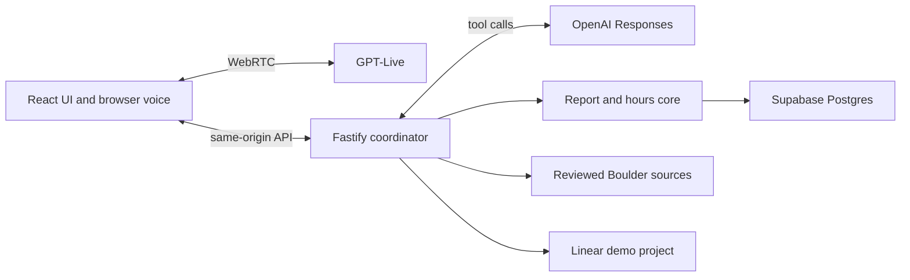

# Boulder voice agent — reviewer writeup

**Try it.** https://threefold-boulder-agent.onrender.com · access code `reviewer-f8b70238e4fc1113` · click **Start voice** (microphone required). Free-tier cold start ~50s. Independent developer demo, not a city service.

**Scope.** A small municipal voice agent for Boulder, Colorado. It answers a reviewed municipal-code question (glass containers in parks), a city-service question (pothole guidance), and live upcoming events from the official calendar; it also takes a pothole or park-maintenance report, confirms the saved details, then routes to a simulated department during office hours or creates a real Linear demo ticket after hours.

**Key decisions.** GPT-Live handles speech and delegates each turn to the browser, which relays it to the server; a separate model proposes a tool and the server validates it. The server — never the model — owns scope, time, confirmation, and every effect. Supabase holds city policy, drafts, and ticket-operation history; Linear owns the ticket, and a create is only claimed after a verified readback. Event answers are a live cached fetch of the official calendar (24-hour TTL, fails closed). Each visitor gets a separate server-owned conversation and bounded voice usage.

**Evaluation.** `npm run check` (offline type/lint/format/unit), `npm run test:db` (local Postgres, 195/195), and `npm run audit:dependencies`; opt-in `eval:reasoning` (tool selection, 18/22 recorded), `eval:conversations` (scenario loop), and a local Promptfoo matrix for regression and model A/B. A closed-hours run created Linear issue DRO-5 and verified it by readback — owner-reported, not an in-repo artifact.

**Gaps.** One city, two report types, browser voice rather than telephony, and simulated transfers rather than real calls. Event answers defer times/cancellations to the official detail pages. Recorded spoken evidence is still outstanding; sessions and quotas are in-process and do not survive a restart. Other deferred items are listed in the README.

**Next.** Record the spoken journey, then rehearse debugging a failed Linear operation or an expired schedule.
