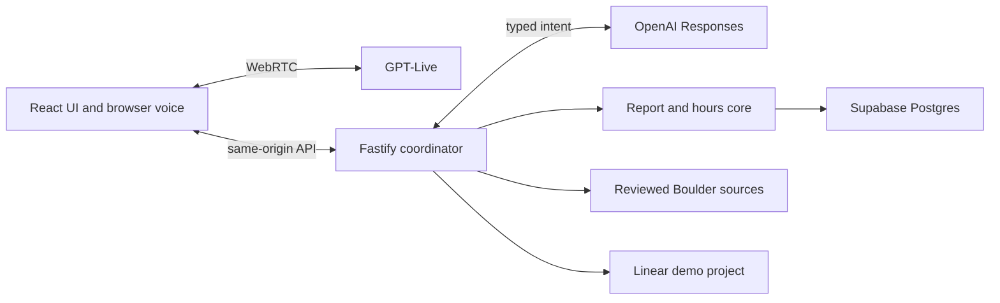

# Boulder voice agent — reviewer writeup (draft)

**Scope.** A small municipal demo for Boulder, Colorado. A caller can ask the reviewed municipal-code question (glass containers in parks), one city-service question (pothole guidance), or for upcoming events fetched live from the official Boulder calendar; report a pothole or park maintenance issue; and review the saved details before an action. Asking "what can you do" returns a fixed spoken options overview. The server reads Boulder hours and department mappings from Postgres. During office hours it shows a clearly simulated route to the configured mock number; after hours, when configured, it creates a Linear demo ticket and verifies the issue through Linear before claiming success.

**Key decisions.** GPT-Live handles speech and delegates tasks; a separate model proposes a bounded intent. Server validation, revision-bound confirmation, and deterministic business-hours code decide effects. Supabase holds city policy, observations, drafts, and ticket-operation history; Linear owns the actual ticket. Event answers use a live cached fetch of the official calendar (24-hour TTL, fails closed) rather than stale checked-in records. The browser uses a small form alongside voice so the reviewer can see what was collected and confirm the exact issue and location. The same application tools support the text examples. Each boundary is testable with a fake or local database; the narrow Linear mock is used only in tests. Each visitor has a separate server-owned conversation and bounded voice usage.

**Evaluation.** `npm run check` runs offline type, lint, format, and unit checks; `npm run test:db` exercises local Postgres; `npm run audit:dependencies` checks advisories. The opt-in `npm run eval:intents` passed 8/8 synthetic live classifications on September 16, 2026, including the two capability-overview cases. Local DB tests currently pass 162/162. A live closed-hours run on September 16 created Linear issue DRO-5 and verified it through an independent Linear API readback (ID, title, description, team, project). Dror also exercised the spoken browser path the same day with a positive report. These results do not prove formal recorded spoken audio or deployed behavior.

**Cuts and current gaps.** This is one city, two report types, browser voice rather than telephony, and simulated transfers rather than real calls. Event answers come from calendar listing cards, so they defer times and cancellation status to the linked official detail pages. Formal recorded spoken evidence (interruption, correction, browser versions) is still outstanding, and the reviewer deployment and hosted access were deferred pending a later decision. The reviewer runtime uses one Node process; its in-memory sessions and quotas do not survive a restart.

**Next.** Run the recorded spoken journey from the voice checklist, then decide whether to deploy the checked revision with managed Supabase and bounded reviewer access. Re-run the source and failure checks on the final revision and rehearse debugging a failed Linear operation or expired schedule.
