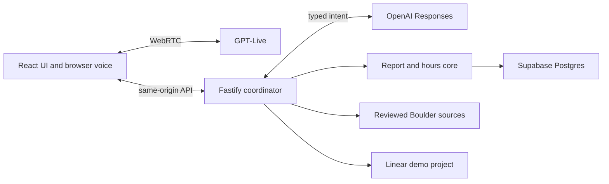

# Boulder voice agent — reviewer writeup (draft)

**Scope.** A small municipal demo for Boulder, Colorado. A caller can ask one reviewed municipal-code question, one city-service question, or one dated City Council event question; report a pothole or park maintenance issue; and review the saved details before an action. The server reads Boulder hours and department mappings from Postgres. During office hours it shows a clearly simulated route to the configured mock number; after hours, when configured, it creates a Linear demo ticket and verifies the issue through Linear before claiming success.

**Key decisions.** GPT-Live handles speech and delegates tasks; a separate model proposes a bounded intent. Server validation, revision-bound confirmation, and deterministic business-hours code decide effects. Supabase holds city policy, observations, drafts, and ticket-operation history; Linear owns the actual ticket. The browser uses a small form alongside voice so the reviewer can see what was collected and confirm the exact issue and location. The same application tools support the text examples. Each boundary is testable with a fake or local database; the narrow Linear mock is used only in tests.

**Evaluation.** `npm run check` runs offline type, lint, format, and unit checks; `npm run test:db` exercises local Postgres; `npm run audit:dependencies` checks advisories. The opt-in `npm run eval:intents` passed 6/6 synthetic live classifications on September 16, 2026. Local tests currently pass 139/139. These results do not prove spoken audio or live Linear behavior.

**Cuts and current gaps.** This is one city, two report types, three reviewed information examples, browser voice rather than telephony, and simulated transfers rather than real calls. The microphone/spoken round trip, real Linear issue/readback, public reviewer access, and cloud deployment still require verification. The event record expires after its stated review window and must be refreshed before submission. The local server supports one developer session; it must gain session-scoped admission before public use.

**Next.** Complete a fresh spoken browser journey, create/read one synthetic issue in the dedicated Linear project, then deploy the same checked revision with managed Supabase and bounded reviewer access. Re-run the source and failure checks on that revision and rehearse debugging a failed Linear operation or expired schedule.
