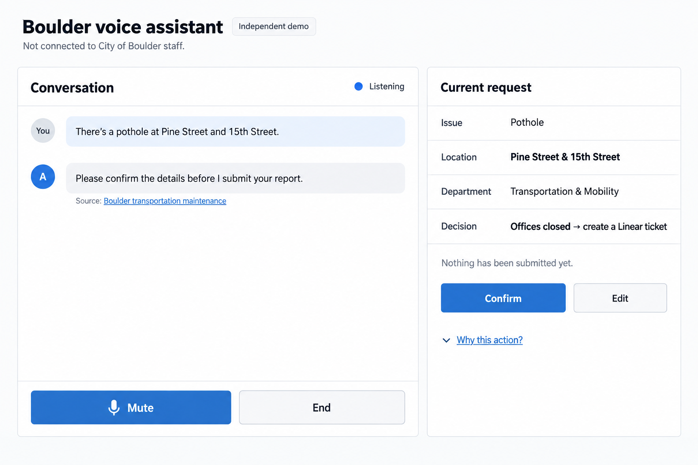

# Boulder interface concept

**Status: selected P0 visual direction; the single-screen demo UI is implemented.** The mockup below was generated with the built-in imagegen tool. All displayed conversation text, office state, location, and action details are synthetic scenario examples.

The [simple responsive concept](boulder-simple-concept.png) is the implementation target. It is deliberately a developer-demo interface: one screen makes the required behavior easy to inspect without spending the assignment window on a broader product shell.

[Generation and revision prompts](PROMPTS.md) preserve the selected prompt and earlier exploration.

## What the first interface demonstrates

The persistent surface contains the independent-demo qualification, short conversation, current voice state, and essential voice controls. Official sources appear inline with the answer they support.

When the conversation produces an actionable request, one `Current request` panel shows:

- issue, location, and routed department;
- the deterministic business-hours decision supplied by the backend;
- revision-bound confirm and edit controls before any external action; and
- only a backend-verified Linear receipt/link or explicitly simulated route outcome after execution.

The request panel is contextual rather than a second dashboard. Information-only conversations do not show an empty ticket form. At narrow widths, the same conversation and request components stack into one column; P0 does not maintain a separate mobile experience.

## Scope rule

An element belongs in P0 when it helps a reviewer verify a mandatory assignment behavior or helps the caller safely complete that behavior. Decorative branding, maps, ticket boards, representative screens, analytics, model controls, internal traces, hold tone, shadow controls, and broader navigation remain deferred. Permission, clarification, execution, failure, uncertainty, simulated route, ticket result, and disconnect states remain required even though each does not receive a separate raster.

The interface presents backend state; it does not determine workflow. Office state and destinations come from validated DB configuration. Confirmation is tied to the current draft revision, corrections invalidate prior confirmation, and success appears only after verified provider evidence. The static mockup cannot establish live hours, Linear activity, accessibility, responsive-browser behavior, or spoken output.

## Implementation checks

Validate semantic controls, visible keyboard focus, screen-reader status announcements, contrast, touch targets, content wrapping, dynamic text, and narrow/wide viewports in the implemented browser UI. Browser checks use the real UI/core/local DB with controlled provider boundaries; actual audio/device and approved real-Linear checks remain separate.

## Superseded exploration

The earlier [desktop concept](boulder-desktop-concept.png) and [mobile concept](boulder-mobile-concept.png) explored a more product-like presentation. They are retained as design history and are not P0 implementation targets. Useful behavior from those explorations is preserved in the specification rather than through extra screens.
