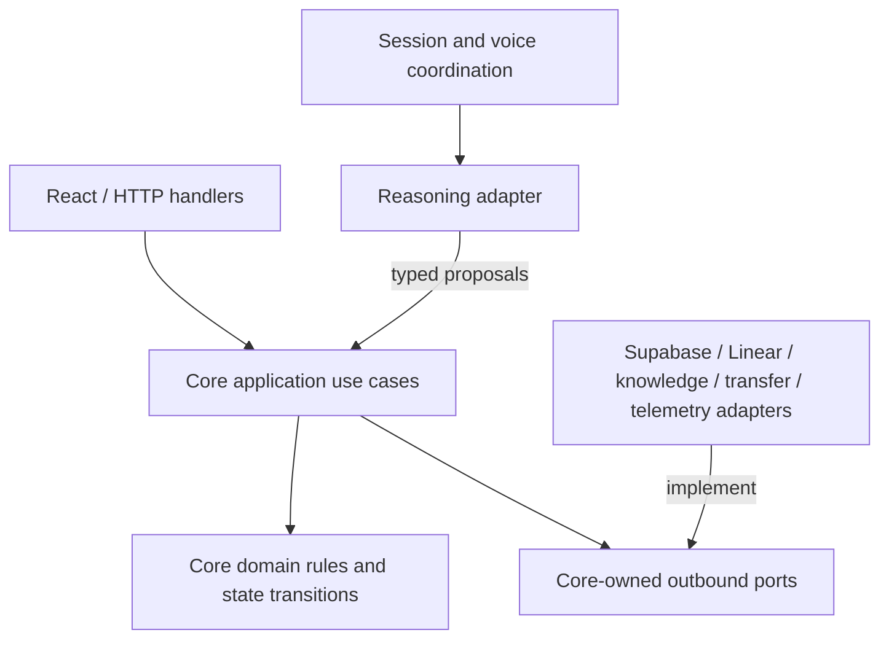

# Application core architecture

## 1. Purpose and scope

Define the provider-neutral Application Core for P0: its authority, domain invariants, inbound use cases, outbound ports, transaction boundaries, failure semantics, and independently testable behavior. This is a review proposal and contains no implementation.

The core is the application's decision and workflow boundary. It accepts server-scoped commands or validated reasoning proposals, applies deterministic rules, persists authoritative state through ports, invokes only allowed effects, and returns stable outcomes and views. It does not contain React components, HTTP handlers, voice/media code, model prompts, provider SDK types, SQL, GraphQL, or deployment configuration.

This specification owns core responsibility and port semantics. The [system architecture](spec-architecture-system.md) owns the whole-system topology and shared envelopes; [workflow](spec-process-workflow.md) owns request fields, confirmation/state transitions, and business-hours policy; [integrations](spec-tool-integrations.md) owns normalized provider receipts, attempts, persistence entities, and reconciliation details. Those documents remain authoritative for their data rather than being copied here.

## 2. Definitions

**Application Core:** Provider-neutral domain rules plus application orchestration. **Domain rule:** Pure deterministic rule over validated values. **Use case:** Named application operation with an explicit input, outcome, and allowed effects. **Inbound port:** Interface used by the server/session layer to invoke a use case. **Outbound port:** Core-owned interface implemented by an adapter. **Proposal:** Untrusted, typed interpretation from a reasoning adapter; never authorization. **Observation reference:** Server-issued reference to caller/UI evidence, rather than caller text copied into trusted state. **Revision:** Immutable integer identifying one version of collected request details. **Authorization point:** Atomic persisted transition that approves one exact revision and prepares an operation. **Operation:** Durable logical external action with one identity and bounded attempts. **Attempt:** One provider invocation within an operation budget. **Uncertain:** The effect may have committed but no authoritative receipt or absence is established. **View:** Bounded presentation-safe projection; not a persistence entity or provider response.

## 3. Requirements, constraints, and guidelines

### Authority and dependency rules

- **COR-001:** Core source code shall import no OpenAI, Linear, Supabase, browser, HTTP-framework, telemetry-exporter, or provider SDK types.
- **COR-002:** The core shall be the only layer that authorizes staff actions, selects an allowed policy result, owns operation attempt/deadline budgets, and changes authoritative request/operation state.
- **COR-003:** Reasoning output, browser input, voice transcripts, retrieved passages, and provider text are untrusted boundary data. Runtime schema validity is necessary but does not establish truth, scope, caller intent, or authorization.
- **COR-004:** The server shall create execution identity, opaque admission/ownership scope, mode, trace, and deadline. Every store transition shall atomically compare the admission scope bound to the conversation. The core shall reject missing, expired, stale, cross-conversation, cross-admission, or incompatible context; it shall never accept model/browser-selected identity, permission, production time, budget, provider team, or destination.
- **COR-005:** Pure domain policy and transition functions shall be separated from effectful application orchestration so deterministic behavior can run without network, database, browser, or model access. This separation need not create separate packages or services.
- **COR-006:** Use named use cases and narrow ports. Do not introduce a generic command bus, repository base class, service locator, dependency-injection framework, rules engine, or plugin registry for P0.
- **COR-007:** Create an abstraction for a meaningful external boundary, nondeterminism, or demonstrated reuse. Do not create interfaces for every internal function or erase provider capabilities behind a misleading lowest-common-denominator contract.
- **COR-008:** Stable domain codes and schemas shall have one authoritative definition close to the core. Displayed/spoken wording, provider labels, and database rows shall not control workflow decisions.
- **COR-009:** Starting a voice/model session and each delegated reasoning run shall consume application-owned durable admission/budget state. The session coordinator may invoke the provider, but it shall obtain core authorization first and record the provider outcome/available usage afterward. Direct API and voice paths share the same limits.

### Conversation, information, and request lifecycle

- **COR-010:** A conversation shall be durably opened and scoped before model/voice work that may produce an answer or action. Failure to establish required persistence produces an unavailable result.
- **COR-011:** Information interactions shall use approved evidence, record the bounded answer outcome, and create no request operation, ticket, or transfer.
- **COR-012:** A reasoning proposal may suggest an information topic, supported request type, field update, confirmation candidate, cancellation, limitation, or emergency-like redirection. The core shall validate the proposal against supported capabilities and current state before applying it.
- **COR-013:** Updating critical request details shall increment the draft revision and invalidate confirmation for every earlier revision. Caller-provided field values retain untrusted provenance.
- **COR-014:** Confirmation shall bind a pending server-authored prompt/summary, current draft revision, and observed caller/UI evidence from the same admission/channel scope. The observation shall be complete/final, occur after the prompt was issued, reference that prompt/summary, and be consumed at most once. A boolean, generic or pre-prompt “yes,” replayed evidence, transcript fragment, or model assertion alone shall not establish confirmation.
- **COR-015:** Action authorization shall re-read validated configuration and trusted server time, then atomically recheck scope, supported intent, current revision, confirmation, limits, deadline, blocked state, and existing operation.
- **COR-016:** The authorization point shall persist an immutable operation intent before external mutation. Provider network work shall occur outside the database transaction.
- **COR-017:** A correction winning before authorization prevents the old revision from executing. If authorization wins first, the operation retains that revision; later correction/cancellation cannot silently amend, undo, or claim rollback of a committed or uncertain effect.
- **COR-018:** Cancellation shall produce only a verified state transition. “Stop speaking” affects voice output and is not application cancellation.
- **COR-019:** Closing or losing a browser/voice session shall not erase durable work. The core shall preserve terminal or uncertain operation state and expose an honest resumable/final view.

### Effects, retries, and failures

- **COR-020:** All database, knowledge, ticket, transfer, and telemetry interaction shall cross explicit outbound ports. Adapters shall not call other adapters to bypass core orchestration.
- **COR-021:** The core shall pass prepared, bounded, provider-neutral inputs to action ports. Provider identifiers, credentials, endpoints, and mock destinations are supplied by trusted composition/configuration, never a model proposal.
- **COR-022:** One authorized revision/action kind shall prepare at most one logical operation. Repeated commands and reconnects shall return or reconcile that operation rather than create a second effect.
- **COR-023:** Before each action-port call, the core shall durably record a unique attempt identity/number, consume its budget, and mark it started. The call represents one classified attempt. The application workflow decides whether another attempt is permitted under the operation deadline and remaining budget. An attempt still marked started after interruption is treated as potentially committed and enters recovery/reconciliation; write retries require authoritative no-commit evidence or a verified provider idempotency guarantee.
- **COR-024:** A possibly committed write shall become `uncertain` and enter bounded reconciliation. Neither a timeout nor an inconclusive search authorizes blind recreation.
- **COR-025:** Adapter failures shall be normalized into stable semantic outcomes such as unavailable, rejected, retryable read failure, known write failure, or uncertain write. Provider text/status codes may be retained as redacted diagnostic metadata but shall not leak into domain branching.
- **COR-026:** Telemetry failure shall not change authorization or overwrite durable outcomes. Durable application state remains authoritative.
- **COR-027:** Unsupported capabilities, invalid configuration, required persistence failure, exhausted limits, and expired deadlines shall block new effects with a diagnosable stable code.
- **COR-028:** If a provider reports success/readback but durable result persistence fails, the core shall not report confirmed success. The pre-call attempt record shall make recovery treat the operation as uncertain until the receipt is safely persisted or reconciled; repetition shall not recreate the effect.
- **COR-029:** Pending simulated transfers shall reach terminal state only through a core use case. The `TransferProvider` may start, inspect, or cancel its own simulation, but it shall not write application state or emit caller-visible completion directly.

### Security, views, and maintainability

- **COR-030:** Reads and writes shall be scoped through a server-resolved admission bound to conversation ownership. The opaque admission reference is server-only and excluded from views/model context/log payloads. Knowledge of a conversation, draft, operation, or provider ID is not access authorization.
- **COR-031:** The core shall enforce configured session/action/model/tool budgets before invoking an effect. Repeated calls through model or direct API paths use the same durable counters.
- **COR-032:** Core events shall record safe correlation IDs, revisions, policy/config versions, state transitions, attempts, and outcomes. They shall exclude credentials, hidden chain of thought, raw audio, and unnecessary caller text.
- **COR-033:** Presentation layers shall consume bounded views and outcomes from application use cases, not query Supabase or Linear directly. A current Linear refresh remains an authorized core use case and is visibly distinguished from a stored snapshot.
- **COR-034:** Core functions shall use explicit control flow, cohesive modules, descriptive domain names, and meaningful failures. DRY applies to shared rules and schemas; superficially similar department or provider code is not sufficient reason for a generic framework.
- **COR-035:** P1/P2 features may extend a stable use case or add a capability-specific port without changing P0 semantics. A replacement adapter must preserve outcome meaning and expose unsupported capabilities explicitly.

### Proposed P0 simplification for review

- **COR-P01:** Allow at most one nonterminal service-request draft per conversation. The configured session budget may permit a later sequential request after the first becomes terminal. This avoids ambiguous voice references and a multi-request UI while preserving future extension. This proposal requires Dror's acceptance before implementation.

## 4. Interfaces and data contracts

### Contract ownership

| Contract | Authoritative owner | Core usage |
| --- | --- | --- |
| `ExecutionContext`, public `Outcome<T>`, `DomainEvent` | [System architecture](spec-architecture-system.md) | Validate context; return stable outcomes; emit correlated events. |
| `CityConfig`, `RequestDraft`, confirmation and request transition rules | [Workflow](spec-process-workflow.md) | Apply pure policy and revision-bound transitions. |
| Operation, attempt, prepared ticket, ticket snapshot, transfer result | [Integrations](spec-tool-integrations.md) | Prepare effects and normalize results without provider types. |
| Evidence bundle and supported-answer provenance | [Knowledge](spec-data-knowledge.md) | Restrict information answers to approved scoped evidence. |
| Voice/reasoning events and capability metadata | [Voice](spec-design-voice.md) | Accept validated proposals and provide verified application updates. |

### Dependency boundary

Runtime calls may travel from use cases to adapters, but source-code dependencies point inward: adapters depend on core port contracts; core never depends on adapter implementations.

### Inbound application use cases

The signatures below describe semantic boundaries, not a required class hierarchy. M0 may implement plain typed functions grouped by cohesive responsibility.

| Use case | Required input | Result and allowed effects |
| --- | --- | --- |
| `openConversation` | Server admission/ownership, city, mode, version metadata | Persist scoped conversation and session budget; return bounded active view/admission or unavailable. |
| `reserveReasoningRun` | Context, allowed purpose, current session/run budget | Atomically reserve a bounded delegation/run or return blocked; no provider call occurs here. |
| `recordReasoningRun` | Context, reserved run ID, normalized provider outcome and available usage | Persist completion/failure/usage metadata and release/close the reservation honestly. |
| `retrieveEvidence` | Context plus supported topic/query and freshness need | Call `KnowledgeProvider`; return approved evidence bundle, insufficient/conflicting, or unavailable. No arbitrary URL. |
| `recordInformationResult` | Context, bounded answer, evidence references issued for this run | Persist information outcome and sources; no draft operation, ticket, or transfer. |
| `updateDraft` | Context, expected revision, supported field patch, observation references | Validate/normalize bounded fields, atomically apply revision, invalidate stale confirmation; return draft view, needs input, conflict, or blocked. |
| `requestConfirmation` | Context, draft ID, current revision | Persist server-authored summary/reference; return pending confirmation view. |
| `recordConfirmation` | Context, pending confirmation ID, complete/final observation or UI evidence reference | Verify same-scope, post-prompt, single-use, explicit current-revision acceptance; return ready, needs confirmation, conflict, or blocked. |
| `executeRequest` | Context, draft ID, expected revision | Re-read config/time, atomically authorize/prepare one operation, invoke allowed action port, persist result; return completed, pending, uncertain, failed, or blocked. |
| `cancelRequest` | Context, draft ID, expected revision | Persist draft cancellation before authorization. For an authorized pending simulated transfer, request provider cancellation only when its capability allows and persist only a verified cancelled result; otherwise return actual executing/completed/uncertain state. |
| `reconcileOperation` | Authorized context, operation ID | Advance a pending simulated transfer through status inspection or reconcile an uncertain ticket through the applicable action port; persist a verified terminal result or retain pending/uncertain state. |
| `refreshLinkedTicket` | Authorized context and linked operation reference | Read current ticket through `TicketProvider`; return timestamped provider snapshot, not-found, or unavailable without creating anything. |
| `getConversationView` | Authorized context | Return bounded current conversation/draft/operation/source state; no raw provider objects or cross-session data. |
| `closeConversation` | Authorized context and close reason | Persist close/finalization state; retain committed/uncertain work and return final bounded view. |

### Reasoning proposal boundary

The session coordinator invokes `ReasoningBackend` and maps its runtime-validated output to named use cases. The core accepts only a closed proposal union equivalent to:

- information topic/evidence request;
- supported service-request field patch;
- current confirmation candidate with observation reference;
- cancellation candidate;
- unsupported municipal request/coverage limitation; or
- emergency-like redirection that is prohibited from routine maintenance action.

No proposal may contain an executable provider name, URL, SQL, phone number, Linear team, destination, permission, confirmation boolean, retry count, production timestamp, or arbitrary action name. Unknown proposal variants are rejected.

### Outbound ports invoked by the core

| Port | Core expectation | Adapter responsibility |
| --- | --- | --- |
| `Clock` | Trusted UTC instant for deadlines and policy; fixed fake in tests. | Server clock implementation; timezone conversion follows validated config. |
| `ConversationStore` | Scoped durable reads, atomic revision/confirmation/operation transitions, quotas, result persistence. | Supabase implementation with transactions/constraints and explicit unavailable/conflict outcomes. |
| `CityConfigStore` | Versioned validated snapshot fresh enough for authorization. | Supabase implementation; no model/browser mutation path. |
| `KnowledgeProvider` | Approved bounded evidence with provenance/freshness or explicit insufficiency/conflict. | Reviewed corpus initially; no arbitrary caller URL fetching. |
| `TicketProvider` | One prepared attempt; classified create/read/reconcile result and capability metadata. | Linear translation, identity/team validation, receipt/readback, and redacted diagnostics. |
| `TransferProvider` | Start one allowed simulated route and inspect/cancel it through explicit capabilities; return normalized pending/answered/failed/cancelled results. | Configured simulation; never accepts/dials an arbitrary number and never writes application state directly. |
| `OperationalEvents` | Best-effort validated event emission that cannot authorize work. | OpenTelemetry/test observer translation and redaction. |

`ReasoningBackend` and `VoiceSession` use core-owned or shared contracts but are orchestrated by the session layer. The session obtains application admission/budget before provider work and reports normalized outcome/usage afterward. Neither adapter may invoke effect adapters directly. Exact retry delays may be injected at the retry runner when implemented; P0 shall not add a general scheduler abstraction merely to avoid test waits.

### Authorization and effect sequence

For every staff action, the use case shall execute this order:

1. Validate server context, ownership, deadline, capability, and command shape.
2. Load the current draft and validated configuration; obtain trusted time.
3. Evaluate pure required-field, confirmation, limit, and business-hours policy.
4. Atomically compare expected revision/state and persist one operation intent with configuration/time evidence.
5. Before every provider invocation, durably record/consume one unique started attempt; the first attempt may be prepared in the operation transaction.
6. Commit the database transaction containing the attempt intent.
7. Invoke the selected action port for that attempt.
8. Persist the classified result before reporting success, known failure, or uncertainty.
9. Emit safe events and return a bounded view/outcome. Telemetry failure does not rewrite the durable result.

Steps 2–5 must be expressed through store operations/transactions that prevent time-of-check/time-of-use authorization races and make a crash after provider send recover as a started, potentially committed attempt. A provider network call never runs inside a database transaction.

### Outcome and view rules

- Public outcomes use the shared statuses: `completed`, `needs_input`, `needs_confirmation`, `pending`, `uncertain`, `blocked`, or `failed`.
- Stable codes explain invalid input, state conflict, unsupported capability, unavailable configuration/persistence/provider, limit/deadline rejection, known failure, and uncertainty without exposing secrets or raw provider responses.
- `retryable` classifies a failure; it does not authorize the caller, UI, or model to retry.
- Views may contain current bounded draft fields, source links, policy explanation, action progress, verified receipt/link, simulated destination label, and fetched-at timestamp. They omit credentials, arbitrary metadata, other-session identifiers, raw transcripts/audio, and hidden reasoning.

## 5. Acceptance criteria

- **AC-COR-001:** Given core source, when the architecture check scans imports, then no provider/browser/server-framework SDK is imported.
- **AC-COR-002:** Given an information proposal with approved evidence, when recorded, then the conversation and sources persist and no action operation exists.
- **AC-COR-003:** Given a pothole proposal without a location, when applied, then the result needs input and no confirmation/action begins.
- **AC-COR-004:** Given current details awaiting confirmation, when same-scope complete evidence observed after the prompt explicitly confirms its current summary, then that revision becomes ready. Pre-prompt, fragmented, wrong-scope, stale-prompt, ambiguous, or previously consumed evidence does not.
- **AC-COR-005:** Given a correction before authorization, when the old revision executes, then it conflicts without provider invocation. Given authorization wins first, later correction does not alter the operation's immutable revision.
- **AC-COR-006:** Given valid open-hours configuration and a confirmed supported request, when executed, then one simulated-route operation is prepared and no ticket call occurs.
- **AC-COR-007:** Given valid closed-hours configuration and the same request, when executed, then one ticket operation is prepared and no transfer call occurs.
- **AC-COR-008:** Given missing, invalid, expired, or unsupported configuration, when a policy-dependent request executes, then the effect is blocked with a stable reason.
- **AC-COR-009:** Given concurrent repeated execution commands for the same revision, when authorization runs, then one logical operation is prepared and at most one concurrent provider attempt starts.
- **AC-COR-010:** Given a ticket attempt times out after possible commit, when classified, then the operation becomes uncertain; reconnect/repetition returns or reconciles it without blind recreation.
- **AC-COR-011:** Given a wrong or stale admission with an otherwise valid conversation/draft/operation ID, when any use case runs, then access is denied before an effect adapter receives the request.
- **AC-COR-012:** Given telemetry export failure after a durable provider result, when the use case completes, then the durable result remains authoritative and the outcome does not become false failure/success.
- **AC-COR-013:** Given a replacement conforming fake adapter, when the same core cases run, then outcome semantics remain unchanged; unsupported capabilities fail explicitly.
- **AC-COR-014:** Given a conversation view request, when returned, then it contains only bounded authorized state and distinguishes stored snapshots from fresh provider reads.
- **AC-COR-015:** Given repeated voice/direct reasoning requests after the durable run budget is exhausted, when either path requests another run, then it is blocked before the reasoning provider is invoked.
- **AC-COR-016:** Given a provider call is sent and the process stops before result persistence, when the operation recovers, then its durable started attempt is treated as potentially committed and no blind retry occurs.
- **AC-COR-017:** Given the provider returns a verified receipt but saving that receipt fails, when the caller receives an outcome, then confirmed success is withheld and the operation remains recoverably uncertain without a duplicate create.
- **AC-COR-018:** Given a simulated transfer starts pending, when its status later becomes answered, failed, or cancelled, then `reconcileOperation` persists and publishes that terminal state; a direct adapter callback cannot bypass core state.

## 6. Test automation strategy

Use TDD for every deterministic core slice: select SPEC behavior, write an independently expected failing test, implement the smallest behavior, refactor with tests green, then commit behavior/tests/spec evidence together.

- `npm run test:core` shall run with fixed clocks and in-memory port fakes, without network, database, browser, model, credentials, or paid APIs.
- Table-driven tests cover policy boundaries, state transitions, stable outcome codes, limits, unsupported capabilities, and both correction/authorization race results at the use-case contract level.
- Fake ports shall record calls and return semantic outcomes; they shall not duplicate production policy or make tests pass by importing the production decision as their expected value.
- Real atomicity, constraints, transaction isolation, restart recovery, and cross-session persistence are separate Supabase integration tests.
- Adapter contract tests verify translation/classification independently; approved provider E2E tests supplement rather than replace core tests.
- Critical tests shall demonstrate detection of representative defects such as treating closing time as open, accepting stale confirmation, choosing the wrong action, invoking an adapter before persisted authorization, or recreating an uncertain write.
- Coverage is a diagnostic. No percentage substitutes for mapped P0 branches and meaningful failure tests.

## 7. Rationale and context

The core is implemented first because it defines the meaning that UI, voice, reasoning, storage, and provider integrations must preserve. Pure rules make business-hours, confirmation, and state behavior cheap to test. Effect ports isolate provider protocols while durable authorization prevents a flexible model from acquiring application authority.

Hexagonal boundaries do not require many services or classes. One Node application with plain functions, explicit dependencies, and a small number of external ports provides the relevant benefits. The abstraction boundary follows risk and ownership: providers can change, while the domain meaning of confirmation, operation identity, uncertainty, and honest outcomes must remain stable.

## 8. Dependencies and external integrations

### Internal dependencies

- Shared runtime validation and TypeScript contracts selected in M0.
- Workflow policy and state contracts.
- Security/session admission contracts.
- Versioned scenario-to-check manifest.

### External systems behind ports

- Supabase/PostgreSQL for `ConversationStore` and `CityConfigStore`.
- Linear for the first `TicketProvider`.
- Reviewed Boulder corpus for `KnowledgeProvider`.
- Application simulation for the first `TransferProvider`.
- OpenTelemetry-compatible observer for `OperationalEvents`.

OpenAI voice/reasoning and React are adjacent adapters/clients of core contracts, not core dependencies. Exact packages and versions remain M0 decisions after supported-version and advisory review.

## 9. Examples and edge cases

**Closed-hours pothole:** Reasoning proposes `pothole` plus caller-provided intersection and description. Core validates fields, requests confirmation, binds explicit evidence to revision 2, reloads configuration/time, atomically prepares one ticket operation, calls `TicketProvider`, persists a verified receipt, and returns a demo-qualified link.

**Correction race:** Revision 2 is confirmed. A correction and execute command race. If correction commits first, revision 3 invalidates confirmation and execution conflicts. If authorization commits first, the operation remains bound to revision 2; the new information cannot silently mutate the ticket.

**Ambiguous provider write:** Linear connection times out after sending the mutation. The adapter returns uncertain. Core persists uncertainty and schedules/permits bounded reconciliation. A repeated UI/model command sees the existing operation rather than issuing another create.

**Rejected designs:** React calling Linear directly; reasoning selecting a phone number; an adapter deciding whether offices are open; a generic `executeTool(name, args)` core method; a Supabase row shape used as a domain object; retry middleware blindly repeating writes; exact provider error text controlling workflow.

## 10. Validation criteria

Before implementation authorization:

- Review COR-001–COR-035 and inbound/outbound port ownership with Dror.
- Decide COR-P01 (one nonterminal draft per conversation).
- Confirm that reasoning remains session-orchestrated and cannot call effect adapters.
- Confirm application-owned attempt/reconciliation policy and the one-attempt adapter contract.
- Confirm bounded views are the only presentation read boundary.
- Check that no contract conflicts with the workflow, integration, voice, security, or root acceptance scenarios.
- Map initial TDD cases to A4–A8, A12–A14, A17–A21, A23–A24.

M0 validates dependency rules and contract schemas. M2 validates provider-free core behavior plus real local DB concurrency/state. Planning review is not implementation evidence.

## 11. Related specifications and further reading

[Root SPEC](../SPEC.md), [system architecture](spec-architecture-system.md), [workflow](spec-process-workflow.md), [integrations](spec-tool-integrations.md), [knowledge](spec-data-knowledge.md), [voice](spec-design-voice.md), [security/observability](spec-process-security-observability.md), [evaluation](spec-process-evaluation.md), and [development plan](../DEVELOPMENT_PLAN.md).

Architecture background: [Hexagonal Architecture](https://alistair.cockburn.us/hexagonal-architecture/). Provider and concurrency claims still require their dedicated adapter/database evidence.
