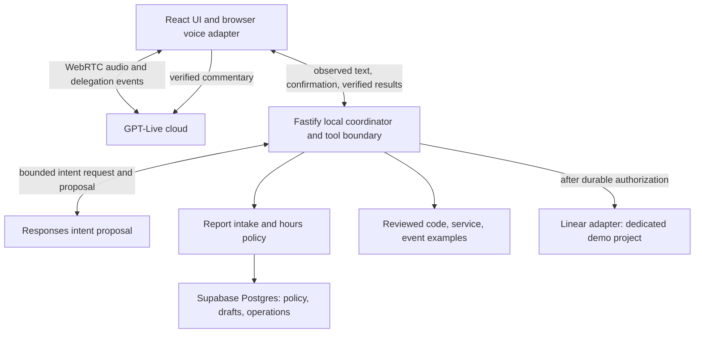

# System architecture

## 1. Purpose and scope

Define the boundaries of the P0 modular application and the seams for P1 providers/comparison. Root [SPEC](../SPEC.md) defines scope and decisions; the [Application Core specification](spec-architecture-application-core.md) refines core authority, use cases, and port semantics. The diagram below maps the implemented local slice; the port table and type sketches also describe planned boundaries that are not all implemented.

## 2. Definitions

**Port:** application-owned interface. **Adapter:** provider-specific implementation of a port. **Core:** policy and workflow code independent of providers. **Run:** one reasoning/workflow execution. **Operation:** tracked external action. **Revision:** immutable identity of the current collected request details. **Capability:** explicitly supported provider behavior.

## 3. Requirements, constraints, and guidelines

- ARC-001: One Node service and React UI initially; no microservices or dependency-injection framework required.
- ARC-002: Core defines contracts; adapters depend on core. Core imports no OpenAI/Linear/Supabase/browser SDK types.
- ARC-003: Presentation, conversation, reasoning, application, and adapters are responsibilities, not a fixed network chain.
- ARC-004: Runtime validation at browser/model/provider boundaries; reject unknown action names and oversized input. Enumerations/JSON validity do not establish semantics or authority.
- ARC-005: Workflow owns side effects, state, deadlines, and retry policy. Reasoning returns proposals; it never acquires mutation credentials.
- ARC-006: Explicit provider capabilities and unsupported outcomes; avoid a lowest-common-denominator interface that silently changes behavior.
- ARC-007: Stable provider-neutral operational events and trace propagation across asynchronous work.
- ARC-008: Maintain cohesive responsibility-based folders. Root instructions apply repository-wide; add a nested `AGENTS.md` only for non-obvious local responsibility, dependency/safety boundaries, conventions, specialized checks, or pitfalls. Do not generate empty layers or instruction files for structural symmetry.
- ARC-009: Presentation/session layers invoke named Application Core use cases and consume bounded views. They do not read provider/storage adapters directly. Reasoning proposals pass through core validation and cannot invoke effect adapters.
- ARC-010: Voice and text adapters normalize user observations into the same server-scoped conversation workflow and render the same bounded outcomes through their own channels. Channel provenance remains attached to confirmation evidence; the core never branches into a separate policy or ticket workflow by channel.



Arrows show the current local runtime, not a deployed multi-user service. The browser receives GPT-Live's delegation event, sends its observed caller text to Fastify, and appends the server's verified reply to the voice session. The model's proposal cannot select a destination, confirm a report, or create a ticket. Fastify checks the current draft and database policy before simulating a route or authorizing a Linear attempt. Text UI actions use the same application tools without WebRTC. Actual microphone playback/event ordering, public admission, telemetry export, and a real Linear ticket remain verification or deployment work; they are not implied by this diagram.

## 4. Interfaces and data contracts

The table below identifies whole-system ports. The [Application Core specification](spec-architecture-application-core.md) owns which ports the core invokes, the inbound use cases, authorization/effect order, and bounded presentation views.

| Port | Input / output | Ownership and failure contract |
| --- | --- | --- |
| Clock | `now(): Date` | Production server time; fixed fake in tests. No model/browser-selected production time. |
| CityConfigStore | city ID -> validated versioned configuration or unavailable | Supabase adapter; fresh read for action authorization in P0. |
| ConversationStore | scoped drafts/evidence/operations and atomic transitions | Compare expected revision/state; return conflict/unavailable. |
| KnowledgeProvider | topic/query + city/time -> evidence bundle | Restricts sources, records freshness, returns insufficient/conflicting explicitly. |
| CityEventProvider | city/query/local-date range + trusted time -> dated event records | Restricts official sources; validates occurrence dates, timezone, status, and freshness. |
| ReasoningBackend | scoped history/state/tool definitions -> typed answer/intake/action proposals | Cancellable bounded work; no direct application mutations. |
| TicketProvider | prepared ticket + server operation ID -> receipt/retryable failure/uncertain; authorized linked reference -> provider snapshot/not-found/unavailable | Simple port fake for core units; real Linear adapter against narrow API mock for adapter tests and actual Linear for E2E/cloud. Scoped references and timestamped snapshots follow the integration contract. |
| TransferProvider | allowed destination + operation ID -> lifecycle result | Simulation initial adapter; no arbitrary number argument from model. |
| VoiceSession | connect/close, context/guidance/update commands, normalized events | Reports capabilities; wraps provider details and failure/playback observations. |
| OperationalEvents | typed domain events and trace context | Replaceable observer/exporter; no authorization decisions. |

Shared shapes:

```typescript
// Specification only; runtime schemas must implement and validate these contracts.
type ExecutionContext = {
  conversationId: string; cityId: string; admissionId: string;
  runId: string; traceId: string; channel: 'voice' | 'text';
  mode: 'live' | 'replay' | 'shadow'; deadlineUtc: string;
}; // Created/resolved by server; admissionId is an opaque authorization scope.
   // The context is never accepted verbatim from model, browser, or caller.
type Outcome<T> =
  | { status: 'completed'; value: T }
  | { status: 'needs_input'; fields: string[] }
  | { status: 'needs_confirmation'; draftId: string; revision: number }
  | { status: 'pending'; operationId: string }
  | { status: 'uncertain'; operationId: string; reason: string }
  | { status: 'blocked' | 'failed'; code: string; retryable: boolean };
type DomainEvent = {
  schemaVersion: 1; eventId: string; conversationId: string;
  runId: string; operationId?: string; revision?: number;
  type: string; occurredAtUtc: string; traceId: string;
  data: Record<string, unknown>; // Allowlisted, event-specific validated payload.
};
```

`retryable` is a classified result, not permission for a model to repeat a write. Workflow enforces operation-wide attempts/deadlines. Public outcomes omit credentials, internal history, and other-session data.

Events include draft_updated, confirmation_requested/recorded/invalidated, evidence_selected, policy_decided, operation_started/attempted/completed/uncertain/failed, conversation_closed, and request_blocked. Keep enum definitions central. Event delivery and API retries can repeat; consumers deduplicate by event/operation ID.

Maintained layout target follows the existing responsibility boundaries. The root, `spec/`, and `design/` hold planning documents/concepts; `src/core/` and `tests/` now contain the first pure policy slice. Other application folders below are created when they first contain maintained files. Nested `AGENTS.md` files are added only where local guidance is materially different; they are omitted from the tree for readability.

```text
/
├── AGENTS.md               # Global engineering instructions
├── README.md               # Entry point and actual setup/check commands
├── SPEC.md                 # Normative scope, decisions, acceptance
├── DECISIONS.md            # Rationale and alternatives
├── DEVELOPMENT_PLAN.md     # Milestones, verification, commits
├── spec/                   # Component contracts and acceptance criteria
├── design/                 # Reviewable UI proposals, assets, generation prompts
├── src/
│   ├── core/               # Provider-neutral contracts, policy, workflow
│   ├── adapters/           # Provider-specific implementations
│   ├── server/             # Composition, auth, configuration, sessions
│   └── web/                # React UI, browser interaction, presentation
├── tests/                  # Core, contract, DB, browser checks and fixtures
├── eval/                   # Model/voice scenarios, rubrics, safe evidence
├── prompts/                # Versioned model instructions/procedures
├── knowledge/              # Reviewed corpus and provenance manifests
└── supabase/               # Versioned DB configuration, migrations, seeds
```

Keep module constants and message catalogs near their consumers; introduce a shared location only for demonstrated reuse. Provider-specific subfolders and test-suite subfolders are added when actual files justify them, with their own notes. Avoid miscellaneous utility folders, unnecessary package/workspace splits, and directory trees that mirror every conceptual layer as a service. Source moves update imports, tooling paths, notes, and SPEC references together. Select libraries/pinned versions in M0, not in core contracts.

When a nested `AGENTS.md` is justified, it contains only the non-obvious local purpose, authoritative SPEC links, allowed dependencies/boundaries, relevant checks, and pitfalls. It inherits root instructions without copying them and remains separate from runtime prompts in `prompts/`. A directory's existence alone is not justification.

Readability/DRY follow root ADR-013. Share one policy, intake/workflow implementation, and schema definition where the same rule is used. Keep adapter interfaces small and code control flow explicit. Avoid unnecessary factories, inheritance, generic registries, and layers; a new abstraction needs demonstrated reuse or a meaningful external boundary.

## 5. Acceptance criteria

- AC-001: Given fake ports and a fixed clock, when a service request runs, then policy and resulting state are verified without provider/network access.
- AC-002: Given a replacement TicketProvider substitute, when the same contract cases run, then required outcomes preserve their meaning.
- AC-003: Given unsupported capability/configuration, when composed, then startup/action authorization rejects it explicitly.
- AC-004: Given a forged context/destination in a tool argument, when validated, then server authority is retained and no unauthorized mutation occurs.
- AC-005: Given a new folder or file move, when architecture/documentation checks run, then references/imports remain valid, prohibited core dependencies are rejected, and any nested `AGENTS.md` that exists has valid links and non-duplicative local guidance. Missing notes are reviewed by the non-triviality rule rather than blanket directory coverage.

## 6. Test automation strategy

`npm run test:core` and `npm run check:architecture` exist; `npm run test:contracts` remains planned. The first architecture check uses Biome to reject named provider/browser/server SDK imports and CommonJS `require` in core. As layers are implemented, extend the check to enforce their actual dependency direction; the first check alone does not prove every possible import path is safe. Documentation validation checks links/structure in root and any justified nested `AGENTS.md`; it does not require directory-wide coverage. Contract checks exercise success, classified error, uncertain outcome, cancellation, and repeated event delivery. Verify real adapters separately; substitutes alone do not establish compatibility.

## 7. Rationale and context

Ports/adapters supports independent tests and changing tools. One service limits delivery overhead. Stable application contracts coexist with provider-specific media capabilities. Prefer straightforward functions/composition over a universal agent abstraction.

## 8. Dependencies and integrations

TypeScript/Node/React selected. Supabase/Linear/GPT-Live are initial adapters. No additional agent framework selected. Shared schema validation and OpenTelemetry are recommended supporting capabilities. Hosted connection/access must pass M1.

## 9. Examples and edge cases

New caller address -> increment revision -> invalidate confirmation -> reject old submit command. Repeated submit -> existing operation result, not a second mutation. Provider timeout -> uncertain outcome, not a fabricated receipt. Live transcript fragment -> partial observation, not a finished caller turn.

## 10. Validation criteria

Review diagram/ownership with Dror. Implement central runtime schemas before integration. Record contract checks against exact candidate revision. This documentation proves no provider has been swapped or measured at scale.

## 11. Related specifications

[Application Core](spec-architecture-application-core.md), [workflow](spec-process-workflow.md), [voice](spec-design-voice.md), [integrations](spec-tool-integrations.md), [security/observability](spec-process-security-observability.md), [plan](../DEVELOPMENT_PLAN.md).

Primary references: [ports/adapters](https://alistair.cockburn.us/hexagonal-architecture), [LiveKit workflows](https://docs.livekit.io/agents/logic/workflows/), [Pipecat typed frames](https://docs.pipecat.ai/api-reference/server/frames/overview).
