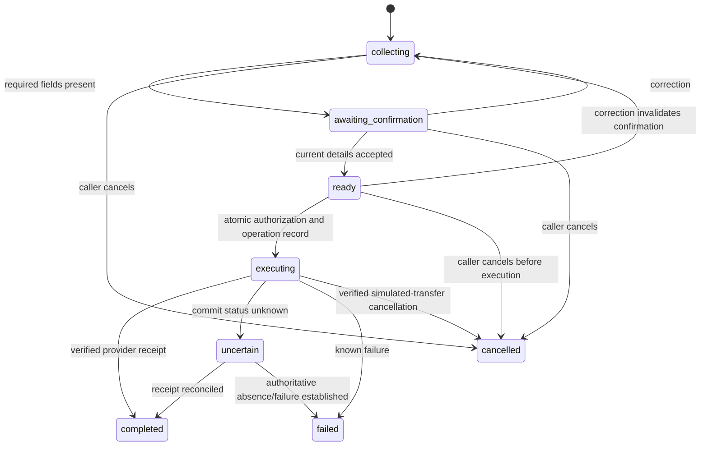

# Workflow and configuration

## 1. Purpose and scope

Define P0 information and nonurgent service-report behavior, DB configuration, and action safety. P1 ticket-always execution is a later extension. [Root SPEC](../SPEC.md) owns scope; [system architecture](spec-architecture-system.md) owns shared envelopes and the [Application Core specification](spec-architecture-application-core.md) owns core use-case/port semantics.

## 2. Definitions

**Draft:** collected report before action. **Confirmation:** caller acceptance of the current critical details, backed by an observed utterance or explicit UI response. **Authorization:** server approval of a permitted state transition; caller confirmation alone does not establish it. **Uncertain:** provider may have committed despite missing receipt.

## 3. Requirements, constraints, and guidelines

- WFL-001: Information bypasses staff-action policy and persists a conversation; no tickets/transfer.
- WFL-002: Pothole requires location (address/intersection) and issue description. Park maintenance requires park/location and issue description. Optional landmark narrows ambiguous location. Names/phone/email are not required in P0.
- WFL-003: Confirm critical collected details before staff action. Do not assert verified/geocoded address from mere caller confirmation.
- WFL-004: Use actual observed caller evidence, not model `confirmed:true`. Bind evidence to draft ID/revision and a pending confirmation request. Evidence must belong to the same admission/channel scope, be complete/final, occur after that confirmation prompt was issued, reference its prompt/summary, and be consumed at most once. Clear ambiguous yes/no references by asking again.
- WFL-005: Read validated DB configuration and server time at authorization; pure policy returns route/ticket/unavailable with explanation.
- WFL-006: Serialize competing transitions for the same draft via DB atomic compare-and-set. Persist operation before external mutation.
- WFL-007: Repeated calls/reconnects return tracked operation state. An unclear timeout is not permission to recreate.
- WFL-008: Application owns attempts/deadlines; model cannot extend them. Configuration/state/persistence failures block new actions.
- WFL-009: Unsupported legitimate requests receive limitation/source guidance; unrelated requests get brief redirection. Emergency-like requests do not enter routine maintenance workflows.

## 4. Interfaces and data contracts

`CityConfig` (server DB data): city ID, revision, timezone, schedule source URL/verifiedAt/validThrough, weekly intervals, verified date overrides, department records, requestType -> department mapping, `alwaysOpenTicket`, feature capabilities. Validate timezone, sorted/nonoverlapping same-day intervals, allowed departments, mock destinations, and validity horizon. P0 reads before each action; caching is P1 unless it preserves an explicit bounded freshness contract.

Recommended P0 schedule: Mon–Fri 08:00–17:00 America/Denver, closed weekends; official verified holiday overrides with a known validity range. Office hours are different from park opening hours. Record gaps as unavailable; do not invent future holiday dates.

Request contract:

| Field | Rule |
| --- | --- |
| draftId / conversationId / cityId | Server creates and scopes; caller/model cannot choose another session. |
| revision | Integer increments on critical detail changes. |
| requestType | `pothole` or `park_maintenance`, chosen from supported enums then validated against context. |
| location | `{kind: address|intersection|park, text, landmark?}`; nonempty bounded text, caller-provided provenance. |
| description | Bounded caller issue text, retained separately from trusted prompts. |
| confirmation | Pending prompt/summary ID, revision and issued time; evidence ref with same admission/channel scope, complete/final status, observed time and provenance; single-use consumption; invalidated on correction. |
| state | collecting, awaiting_confirmation, ready, executing, completed, uncertain, failed, cancelled. |

Application entry points (specification signatures):

- `updateDraft(ctx, expectedRevision, observedFields, evidenceRefs) -> draft | conflict | blocked`
- `requestConfirmation(ctx, draftId, revision) -> pendingConfirmation`
- `recordConfirmation(ctx, pendingConfirmationId, evidenceRef) -> ready | needs_confirmation`
- `executeRequest(ctx, draftId, expectedRevision) -> Outcome<ActionReceipt>`
- `cancelRequest(ctx, draftId, expectedRevision) -> cancelled | already_executing | completed | uncertain`

The session coordinator/model extracts possible confirmation from transcript context; core verifies referenced observation, current pending summary/revision, and explicit acceptance. Extraction remains fallible, so unclear speech must be clarified and empirical confirmation evals are mandatory. P0 does not claim mathematically guaranteed voice consent.

The atomic ready -> executing transition is the authorization point. A correction winning the DB comparison beforehand increments the revision, invalidates confirmation, and prevents execution of the old revision. If authorization wins first, retain that immutable authorized revision in the operation; a later correction/cancellation is not automatic rollback. Mark affected request, stop uncommitted work when safe, retain committed result, explain honestly, and do not apply new details to an existing ticket silently. Amendment workflow is P1. Claiming cancellation requires a verified state transition.

Default policy: info -> no action; supported confirmed staff request -> route when open, ticket when closed. `alwaysOpenTicket=true` is rejected by P0 composition until P1 enabled. Pure policy extension tests may cover both flags without implying dual-action execution exists.

Authorization checks: session scope, supported intent, current revision/confirmation, guardrail state, quota, config validity, deadline, existing operation. Record reason/config revision/UTC and local time. Retry does not reclassify an already-started operation at the closing boundary.

## 5. Acceptance criteria

- AC-001: Given Monday 07:59:59/08:00/16:59:59/17:00 local timestamps, when evaluated, then closed/open/open/closed results are repeatable.
- AC-002: Given weekend/verified closure, when an equivalent report executes, then one ticket/no transfer results.
- AC-003: Given a correction winning before atomic authorization, when the old revision executes, then conflict/no mutation. If authorization wins first, the operation retains its authorized revision and reports the verified or uncertain result without claiming rollback.
- AC-004: Given concurrent identical submissions, when both attempt authorization, then one operation is prepared and no concurrent duplicate provider invocation starts. Distributed write uncertainty follows the integration reconciliation contract.
- AC-005: Given missing config or failed required persistence, when executing, then no external mutation starts.
- AC-006: Given information during any office status, then record it without staff actions.

## 6. Test automation strategy

Planned `npm run test:core`: fixed-clock table cases including DST offsets, weekends, closures, validity expiry, supported departments, all transitions, ambiguous confirmation, duplicate/concurrent calls, expired deadline, and cancelled/blocked requests. Fake stores/providers for pure tests; DB compare-and-set concurrency gets a separate real integration test.

## 7. Rationale and context

Explicit workflow allows bounded, provider-independent behavior and meaningful traces. Model flexibility is useful for speech/interpretation, but authorization and business-hour decisions are application invariants.

## 8. Dependencies and integrations

Clock, CityConfigStore, ConversationStore, TicketProvider, TransferProvider, event/trace boundary. A timezone-capable date implementation must be verified in M0. DB schedule/closure seeds reviewed from official sources; no hard-coded runtime Boulder schedule.

## 9. Examples and edge cases

“Pine” -> ask intersection; “Pine and 15th” -> summarize; explicit yes -> ready. A background “yes” or transcript fragment does not establish acceptance. “Stop talking” controls speech; “cancel the report” invokes application cancellation handling. DB configuration enabled for an unsupported feature -> clear configuration failure.

## 10. Validation criteria

Map checks to A4–A7/A12–A14/A18/A23/A24. Record current config source and validity. Review caller confirmation and post-commit correction limits before implementation. Verify empirical voice scenarios separately.

## 11. Related specifications

[Application Core](spec-architecture-application-core.md), [voice](spec-design-voice.md), [integrations](spec-tool-integrations.md), [knowledge](spec-data-knowledge.md), [evaluation](spec-process-evaluation.md).

Sources: [city hours](https://bouldercolorado.gov/contact-us), [pothole intake](https://bouldercolorado.gov/services/transportation-maintenance), [Live task state](https://developers.openai.com/api/docs/guides/live-delegation).
